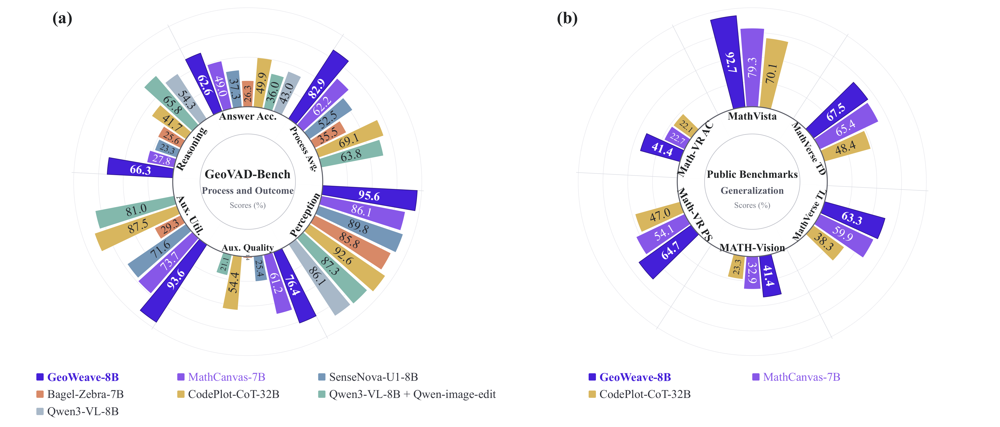

# GeoWeave

This repository is the official code release for the GeoWeave technical
report: [*Beyond Generation and Accuracy: Diagnosing and Enhancing Visual
Chain-of-Thought for Geometry Problem Solving*](https://arxiv.org/pdf/2609.12606).

| Resource | Link |
| --- | --- |
| Technical report | [Paper](https://arxiv.org/pdf/2609.12606) |
| GeoWeave-8B weights | [Model weights](https://huggingface.co/AntResearch/GeoWeave) |
| GeoVAD-Bench data | [Benchmark](https://huggingface.co/AntResearch/GeoWeave) |



## Overview

GeoWeave targets **visual chain-of-thought (VCoT) geometry problem solving**.
Instead of treating the original diagram as a one-time input, the model can
plan an auxiliary construction, generate an updated diagram, read the visual
state back, and continue textual deduction in one interleaved trajectory.

The project combines two components:

1. **GeoVAD-Bench**, a trajectory-level diagnostic benchmark. It evaluates five dimensions:
   original-diagram perception, auxiliary-diagram quality, auxiliary-diagram
   utilization, reasoning-process correctness, and final-answer correctness.
2. **GeoWeave**, a progressive post-training framework that addresses these
   bottlenecks through three-stage SFT followed by interleaved RL with
   step-level credit assignment.

## Key results

On the GeoVAD-Bench, GeoWeave-8B reports the following
results in the technical report, scores are percentages:

| Metric | Base model | GeoWeave-8B | Improvement |
| --- | ---: | ---: | ---: |
| Final-answer accuracy | 37.3 | **62.6** | +25.3 |
| Process Avg. (L1--L4) | 52.5 | **82.9** | +30.4 |
| Perception | 89.8 | **95.6** | +5.8 |
| Auxiliary quality | 25.4 | **76.4** | +51.0 |
| Auxiliary utilization | 71.6 | **93.6** | +22.0 |
| Reasoning | 23.3 | **66.3** | +43.0 |

## Data and training recipe

GeoVAD-Bench contains **600** curated geometry problems requiring auxiliary
constructions, evenly split across Easy, Medium, and Hard difficulty levels.
It covers Chinese and English problems, as well as multiple-choice and
open-ended answer formats. **Some in-house data are currently undergoing review; we will release the full set of evaluation data once the review is complete.**

The training data construction pipeline contains three complementary parts:

- **Geometric perception:** 400K diagram--description pairs.
- **Diagram editing:** 200K instruction-guided auxiliary-construction editing
  samples.
- **Interleaved reasoning:** 100K visual-textual geometry solution
  trajectories.

Training proceeds progressively:

1. Geometry perception warmup, updating the understanding branch.
2. Auxiliary-diagram editing, updating the generation branch.
3. Unified interleaved problem solving, jointly training the complete trajectory.
4. Interleaved RL, using outcome rewards and step-level process credit while
   retaining a velocity-MSE constraint for image generation.

For implementation details, see the [training guide](training/README_TRAINING.md).

## Repository layout

The core files and directories used to run inference, evaluation, and training
are organized as follows:

```text
GeoWeave/
├── src/sensenova_u1/       # Bundled GeoWeave inference runtime
├── configs/
│   └── geo_weave.yaml      # Inference and judge configuration
├── data/                   # JSONL data loading utilities
├── inference/              # Interleaved inference engine and helpers
├── evaluation/             # Level 1–5 evaluation implementation
├── training/               # RL training package and launchers
├── run_inference.py        # Inference entry point
├── run_eval.py             # Overall Level 1–5 evaluation
└── run_eval_ans.py         # Level 5 answer-only evaluation
```

## Environment setup

### Inference and evaluation environment

Create the environment from the **GeoWeave repository root**. The local
inference package is built directly from `src/sensenova_u1`; a separate
upstream model checkout or its virtual environment is not required.

Using `uv` with the CUDA 12.8 PyTorch index configured in `pyproject.toml`:

```bash
cd /path/to/GeoWeave
uv venv --python 3.12
source .venv/bin/activate
uv sync
```

Using `pip`:

```bash
cd /path/to/GeoWeave
python -m venv .venv
source .venv/bin/activate
python -m pip install --upgrade pip
pip install -e .
```

For the Python 3.12 / PyTorch 2.8 / CUDA 12.x inference environment, the
validated FlashAttention wheel is:

```text
flash_attn-2.8.3.post1+cu12torch2.8cxx11abiTRUE-cp312-cp312-linux_x86_64.whl
```

Install it separately after installing the base environment:

```bash
pip install /path/to/flash_attn-2.8.3.post1+cu12torch2.8cxx11abiTRUE-cp312-cp312-linux_x86_64.whl
```

Without FlashAttention, `attn_backend: auto` can fall back to PyTorch SDPA.

Judge requests use the endpoint and credentials configured in the YAML file.
For the supplied configuration, set the judge API key:

```bash
export JUDGE_API_KEY=your_api_key
```

Also replace the example judge endpoint in `configs/geo_weave.yaml` with the
endpoint available to you.

## Benchmark data format

The benchmark is a JSONL file. Each line describes one problem:

```json
{
  "id": "example-001",
  "images": ["images/problem.png"],
  "query": "<image0>\nFind the value of ...",
  "answer": "60",
  "thinking": "Reference reasoning ..."
}
```

- `id`: unique sample identifier.
- `images`: image paths relative to the benchmark JSONL file.
- `query`: problem statement; `<image0>` refers to the first image.
- `answer`: ground-truth final answer.
- `thinking`: reference reasoning used by process-oriented evaluations when applicable.

Relative image paths are resolved first against the benchmark JSONL directory and then against `inference.image_root` when that optional configuration value is set. Absolute image paths are used unchanged.

## Inference

Run GeoWeave interleave inference with a YAML configuration:

```bash
python run_inference.py \
  --config configs/geo_weave.yaml \
  --bench path/to/bench.jsonl \
  --output-dir results/run1
```

After installation, the equivalent console entry point is also available:

```bash
geoweave-infer \
  --config configs/geo_weave.yaml \
  --bench path/to/bench.jsonl \
  --output-dir results/run1
```

Common options:

```bash
# Use selected GPUs
python run_inference.py ... --gpus 0,1,2,3


# Resume and skip sample IDs already present in the output
python run_inference.py ... --resume

# Generate multiple candidates per sample
python run_inference.py ... --pass-n 4 --temperature 1.0 --top-p 0.6

# Print worker commands without launching inference
python run_inference.py ... --dry-run
```

`--model-path` can override the model path in the configuration. For the checked-in template, `inference.model_path` is intentionally empty, so pass this option or fill the YAML before running. The path must point to a directly loadable Hugging Face-format GeoWeave checkpoint directory or model identifier. This release expects the checkpoint to be already exported in that format; checkpoint conversion is outside the scope of this repository.

The output directory contains the merged prediction files and run summaries, including:

- `predictions.jsonl`: model predictions and generated auxiliary-image paths.
- `trace.jsonl`: inference trace information.
- `summary.json`: run statistics.
- Per-worker shard files when `--keep-shards` is enabled.

## Evaluation

### Overall evaluation

By default, `run_eval.py` evaluates all five levels and writes each result to an aligned subdirectory:

```text
results/eval/
├── level1/
├── level2/
├── level3/
├── level4/
├── level5/
└── all_summary.json
```

Run all levels. `run_eval.py` expects the **inference output directory** (the directory containing `predictions.jsonl`):

```bash
python run_eval.py \
  --predictions results/run1 \
  --config configs/geo_weave.yaml \
  --bench path/to/bench.jsonl \
  --output-dir results/eval
```

A subset can be selected with `--levels`, for example:

```bash
python run_eval.py ... --levels 1 2 3
```

Level 3 automatically uses the Level 2 output directory for the auxiliary-line instructions it needs.

### Answer-only evaluation

To evaluate only final-answer correctness, use `run_eval_ans.py`. Unlike `run_eval.py`, this script expects the **exact `predictions.jsonl` file path** rather than the inference output directory:

```bash
python run_eval_ans.py \
  --config configs/geo_weave.yaml \
  --predictions results/run1/predictions.jsonl \
  --bench path/to/bench.jsonl \
  --output-dir results/eval/level5
```

`run_eval_ans.py` supports `--no-llm-fallback`, `--qps`, and `--workers` for controlling answer judging.

## Training

GeoWeave supports both supervised fine-tuning (SFT) and reinforcement learning (RL):

- **SFT:** For the SFT training code and environment setup, refer to the
  [OpenSenseNova/SenseNova-U1](https://github.com/OpenSenseNova/SenseNova-U1)
  repository.
- **RL:** The RL training code is provided in the [`training/`](training/)
  directory. For environment setup, configuration, and training instructions,
  see [`training/README_TRAINING.md`](training/README_TRAINING.md).

## Acknowledgements

We sincerely thank the [SenseNova-U1](https://github.com/OpenSenseNova/SenseNova-U1)
and [UniRL](https://github.com/Tencent-Hunyuan/UniRL) teams for open-sourcing
their excellent work. GeoWeave's model implementation and reinforcement-learning
training code build upon these projects. See [`THIRD_PARTY_NOTICES.md`](THIRD_PARTY_NOTICES.md)
for detailed provenance and licensing information.

## Citation

If you find GeoWeave useful in your research or work, please cite our technical
report using the following BibTeX entry:

```bibtex
@misc{GeoWeave,
      title={Beyond Generation and Accuracy: Diagnosing and Enhancing Visual Chain-of-Thought for Geometry Problem Solving}, 
      author={Zhitong Dong and Jicai Pan and Yingguo Gao and Jingting Ding and Hao Chen and Jinjie Gu},
      year={2026},
      eprint={2609.12606},
      archivePrefix={arXiv},
      primaryClass={cs.AI},
      url={https://arxiv.org/abs/2609.12606}, 
}
```
